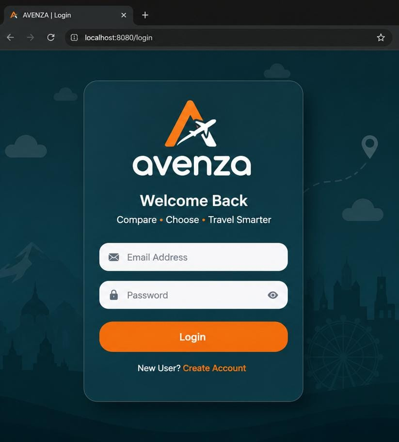
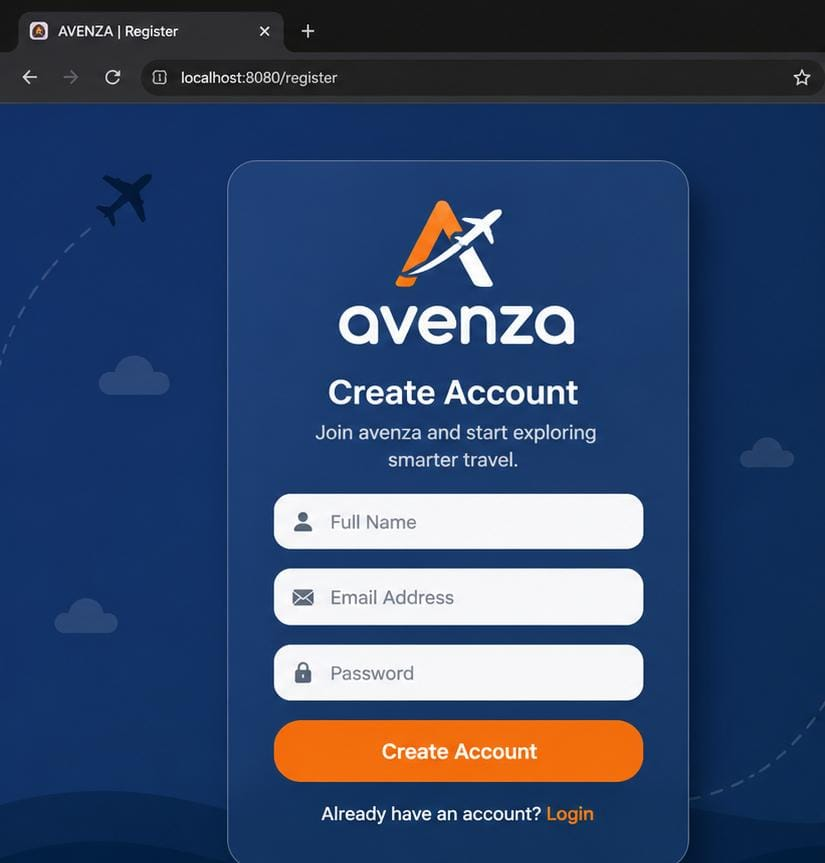
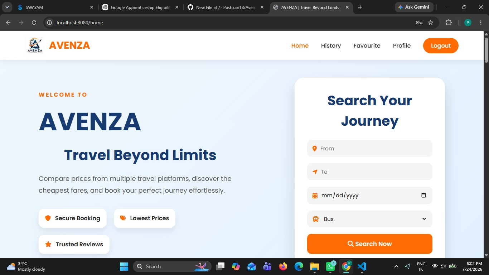
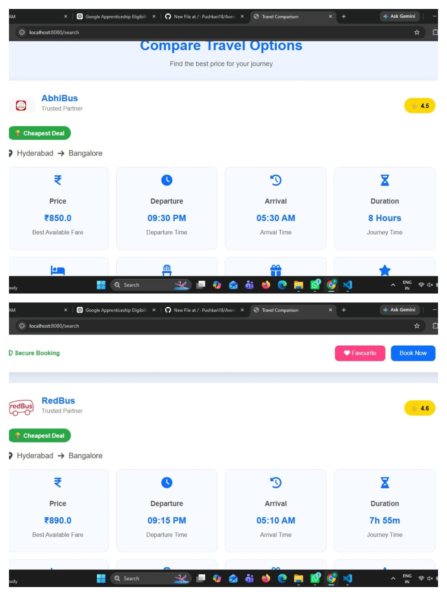

# ✈️ AVENZA – Travel Comparison Platform


---

## 📖 About AVENZA
AVENZA is a **full-stack Travel Comparison Web Application** developed using **Spring Boot**. It allows users to search and compare travel options from different providers based on price, duration, travel type, ratings, and facilities.
The project demonstrates the implementation of a secure authentication system, MVC architecture, database connectivity, and a responsive user interface using modern web technologies.
---

## ✨ Features
- 🔐 User Registration
- 🔑 Secure Login Authentication
- 🛡️ Spring Security Integration
- 🏠 Attractive Home Page
- 🔍 Search Travel Options
- ⚖️ Compare Multiple Travel Services
- ⭐ View Ratings
- 💰 Compare Prices
- ⏱️ Compare Duration
- 🚍 View Travel Type
- ❤️ Favourite Trips
- 📜 Travel History
- 👤 User Profile
- 📱 Responsive User Interface
- 🎨 Modern UI using Thymeleaf
---

## 🛠️ Technologies Used
### Backend
- Java 21
- Spring Boot
- Spring Security
- Spring Data JPA
- Hibernate
### Frontend
- HTML5
- CSS3
- JavaScript
- Thymeleaf
### Database
- MySQL
### Build Tool
- Maven
### IDE
- Visual Studio Code
- Eclipse
---

## 🏗️ Project Architecture
```
Client (Browser)
        │
        ▼
Thymeleaf Templates
        │
        ▼
Spring Boot Controllers
        │
        ▼
Service Layer
        │
        ▼
Repository Layer (JPA)
        │
        ▼
MySQL Database
```
---

## 📂 Project Structure
```
src
├── main
│   ├── java
│   │   └── com.travel.travelcomparision
│   │       ├── controller
│   │       ├── service
│   │       ├── repository
│   │       ├── entity
│   │       ├── config
│   │       └── TravelcomparisionApplication.java
│   │
│   ├── resources
│   │       ├── static
│   │       ├── templates
│   │       └── application.properties
│
└── test
```

---
# 📸 Screenshots
## 🔐 Login Page

---
## 📝 Register Page

---
## 🏠 Home Page

---
## ⚖️ Compare Page

---

## ⚙️ Installation
### Clone Repository
```bash
git clone https://github.com/Pushkari18/Avenza.git
```

### Navigate to Project
```bash
cd Avenza
```

### Configure Database
Open
```
src/main/resources/application.properties
```
Update your MySQL configuration.
```properties
spring.datasource.url=jdbc:mysql://localhost:3306/travelcomparison
spring.datasource.username=root
spring.datasource.password=your_password
```

### Run the Project
Using Maven
```bash
mvn spring-boot:run
```
Or
```bash
./mvnw spring-boot:run
```

### Open in Browser
```
http://localhost:8080
```
---

## 📚 Major Modules
- User Registration
- User Login
- Authentication
- Home Dashboard
- Travel Search
- Travel Comparison
- User Profile
- Favourite Trips
- Travel History
---

## 🔒 Security
- Spring Security
- Password Authentication
- Session Management
- Protected Routes

---
## 🚀 Future Enhancements
- ✈️ Flight Comparison
- 🏨 Hotel Comparison
- 🚆 Train Comparison
- 🚌 Bus Comparison
- 🌍 Google Maps Integration
- 🤖 AI Travel Recommendation
- 💳 Online Payment Gateway
- 📱 Mobile Responsive Enhancements
- ☁️ Cloud Deployment
- 📧 Email Notifications
---

## 🎯 Learning Outcomes
This project helped in understanding:
- Spring Boot Development
- MVC Architecture
- Spring Security
- JPA & Hibernate
- MySQL Integration
- Thymeleaf
- Git & GitHub
- Maven Project Management
- CRUD Operations
- Full Stack Web Development
---

## 👩‍💻 Developer
**Parimi Pushkari**
B.Tech – Information Technology
Shri Vishnu Engineering College for Women
GitHub: https://github.com/Pushkari18
Project Repository:
https://github.com/Pushkari18/Avenza
---

## ⭐ Support
If you found this project useful, please consider giving it a **⭐ Star** on GitHub.
It motivates further development and improvements.
---

## 📜 License

This project is licensed under the **MIT License**.
